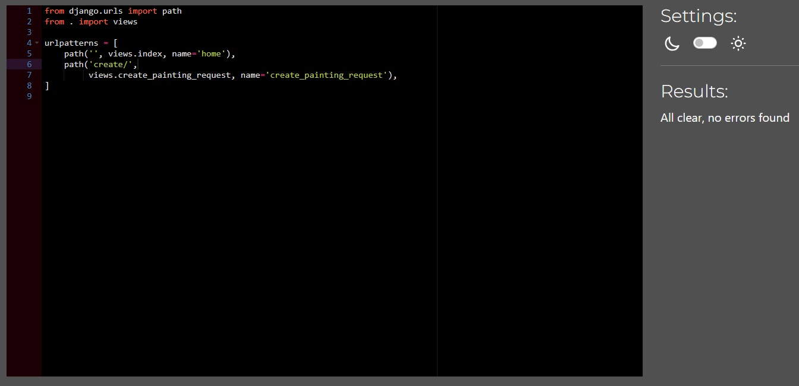

# Artful Urbex - Testing

[Return to the README](README.md)

## Table of Contents
- [Performance](#performance)
  - [Google's Lighthouse Performance](#googles-lighthouse-performance)
- [Browser Compatibility](#browser-compatibility)
- [Responsiveness](#responsiveness)
  - [Smaller screens](#smaller-screens)
  - [Medium screens](#medium-screens)
- [Code Validation](#code-validation)
  - [HTML Validation](#html-validation)
  - [CSS Validation](#css-validation)
  - [PEP8 Validation](#pep8-python)
  - [Javascript Validation](#javascript-validation)
- [Testing](#testing)
  - [Manual Testing](#manual-testing-bdd)
  - [Automated Testing](#automated-testing)
  - [Features Testing](#features-testing)

## Performance

### Google's Lighthouse Performance

Google Lighthouse was used to test the performance of the website.

#### Desktop Results:

Desktop

#### Mobile Results:

Mobile

## Browser Compatibility
|  Browser | Links  | Pages  | Responsivnes  | Form fields  |
| ------------ | ------------ | ------------ | ------------ | ------------ |
| Microsoft Edge  | Works as expected| Loading pages no issue  |  Responsivness works as expected |  Works as expected |
|  Chrome | Works as expected  |  Loading pages no issue | Responsivness works as expected  | Works as expected  |
| Opera  |  Works as expected | Loading pages no issue  | Responsivness works as expected  |  Works as expected |

[Back to the table](#table-of-contents)

## Responsiveness
|   | Galaxy Fold  | Iphone SE   | iPhone12 Pro  | iPad mini  | desktop 1024px  |  desktop > 1200px | notes  |
| ------------ | ------------ | ------------ | ------------ | ------------ | ------------ | ------------ | ------------ |
|  site is responsive >= 700px |  n/a | n/a  |  n/a | Good  | Good  | Good  |   |
| site is responsive < 700px  |  Good | Good  | Good  |  n/a | n/a  |  n/a |   |
| Links/URLs work  | Yes  | Yes   | Yes   |  Yes  | Yes   | Yes   |   |
|  Images work |  Yes  |  Yes  |  Yes  | Yes   | Yes   | Yes   |   |
| Forms work  |  Yes  |  Yes  | Yes   | Yes   | Yes   | Yes   |   |  

# Code validation
## HTML

| Page | W3C URL | Screenshot | Notes |
| --- | --- | --- | --- |
| Home | [W3C](https://validator.w3.org/nu/?doc=https%3A%2F%2Fartful-urbex-3e13a9b6e83c.herokuapp.com%2F) |  | No Errors |
| All Products | [W3C](https://validator.w3.org/nu/?doc=https%3A%2F%2Fartful-urbex-3e13a9b6e83c.herokuapp.com%2Fproducts%2F) |  | No Errors |
| Product Detail | [W3C](https://validator.w3.org/nu/?doc=https%3A%2F%2Fartful-urbex-3e13a9b6e83c.herokuapp.com%2Fproducts%2F3) |  | No Errors |
| Search | [W3C](https://validator.w3.org/nu/?doc=https%3A%2F%2Fartful-urbex-3e13a9b6e83c.herokuapp.com%2Fproducts%2F%3Fq%3Dsunset) |  | Pass: No Errors |
| Bag | [W3C](https://validator.w3.org/nu/?doc=https%3A%2F%2Fartful-urbex-3e13a9b6e83c.herokuapp.com%2Fbag%2F) |  | No Errors |
| Checkout | [W3C](https://validator.w3.org/nu/?doc=https%3A%2F%2Fartful-urbex-3e13a9b6e83c.herokuapp.com%2Fcheckout%2F) |  | No Errors|
| Checkout Success | [W3C](https://validator.w3.org/nu/?doc=https%3A%2F%2Fartful-urbex-3e13a9b6e83c.herokuapp.com%2Fcheckout%2Fcheckout_success%2F958179) |  | No Errors |
| Profile | n/a | | No Errors |
| Edit painting request | n/a |  | No Errors |
| Wishlist | n/a |  | No Errors |

[Back to the table](#table-of-contents)

## CSS

I have used the recommended [CSS Jigsaw Validator](https://jigsaw.w3.org/css-validator) to validate all of my CSS files.

| File | Jigsaw URL | Screenshot | Notes |
| --- | --- | --- | --- |
| base.css | n/a  |  | No Errors |
| checkout.css | n/a |  | No Errors |
| profile.css | n/a |  | No Errors |

### JavaScript

I have used the recommended [JShint Validator](https://jshint.com) to validate all of my JS files.

| File | Screenshot | Notes |
| --- | --- | --- |
| index.html (postloadjs) | | No Errors |
| products/script.js |  | No Errors |
| products-detail.html (postloadjs) |  | No Errors |
| bag.html (postloadjs) |  | No Errors |
| stripe_elements.js |  | Undefined Stripe variable |

## Python

I have used the recommended [CI Python Linter](https://pep8ci.herokuapp.com) to validate all of my Python files.

| File | CI URL | Screenshot | Notes |
| --- | --- | --- | --- |
| Bag contexts.py | n/a |  | No Errors |
| Bag urls.py | n/a |  | No Errors |
| Bag views.py | n/a |  | No Errors |
| Checkout admin.py | n/a  |  | No Errors |
| Checkout forms.py | n/a |  | No Errors |
| Checkout models.py | n/a  |  | No Errors |
| Checkout signals.py | n/a |  | No Errors |
| Checkout urls.py | n/a |  | No Errors |
| Checkout views.py | n/a  |  | No Errors |
| Checkout webhook_handler.py | n/a |  | No Errors |
| Checkout webhooks.py | n/a | | No Errors |
| Home urls.py | n/a |  | No Errors |
| Home views.py | n/a |  | No Errors |
| Home forms.py | n/a |  | No Errors |
| Home models.py | n/a |  | No Errors |
| Home admin.py | n/a |  | No Errors |
| Products admin.py |  n/a |  | No Errors |
| Products forms.py | n/a |  | Pass: No Errors |
| Products models.py |  n/a |  | Pass: No Errors |
| Products urls.py | n/a  |  | Pass: No Errors |
| Products views.py | n/a  |  | Pass: No Errors |
| Products widgets.py | n/a | | Pass: No Errors |
| Profiles forms.py | n/a  |  | Pass: No Errors |
| Profiles models.py | n/a|  | Pass: No Errors |
| Profiles urls.py | n/a |  | Pass: No Errors |
| Profiles views.py | n/a |  | Pass: No Errors |
| Wishlist admin.py | n/a  |  | Pass: No Errors |
| Wishlist models.py | n/a|  | Pass: No Errors |
| Wishlist urls.py | n/a |  | Pass: No Errors |
| Wishlist views.py | n/a |  | Pass: No Errors |
| Base settings.py | n/a  | ![screenshot]| Pass: No Errors |
| Base urls.py | n/a |  | Pass: No Errors |
| Base views.py | n/a |  | Pass: No Errors |