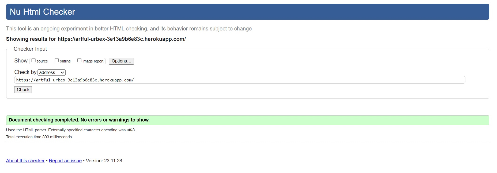
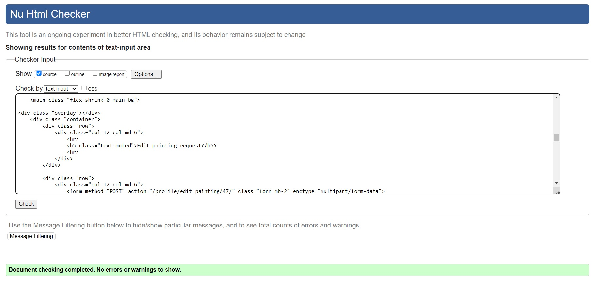
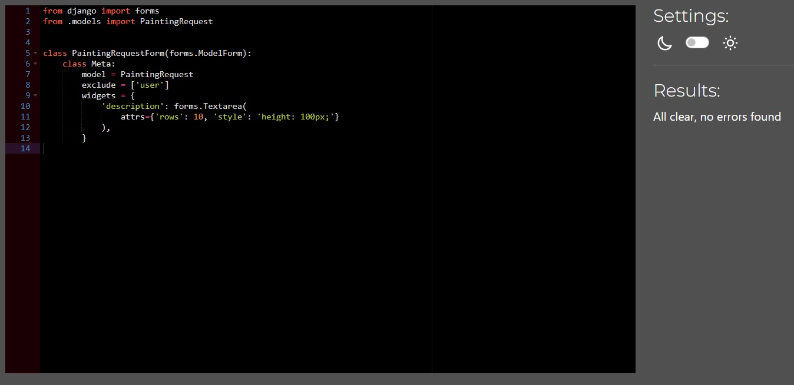

# Artful Urbex - Testing

[Return to the README](README.md)

## Table of Contents
- [Browser Compatibility](#browser-compatibility)
- [Lighthouse Report]
- [Responsiveness](#responsiveness)
- [Code Validation](#code-validation)
  - [HTML Validation](#html)
  - [CSS Validation](#css)
  - [Javascript Validation](#javascript)
  - [PEP8 Validation](#python)
- [Testing](#testing)
  - [Manual Testing](#manual-testing)

## Performance

## Browser Compatibility
|  Browser | Links  | Pages  | Responsivnes  | Form fields  |
| ------------ | ------------ | ------------ | ------------ | ------------ |
| Microsoft Edge  | Works as expected| Loading pages no issue  |  Responsivness works as expected |  Works as expected |
|  Chrome | Works as expected  |  Loading pages no issue | Responsivness works as expected  | Works as expected  |
| Opera  |  Works as expected | Loading pages no issue  | Responsivness works as expected  |  Works as expected |

[Back to the table](#table-of-contents)

## Lighthouse Report

## Responsiveness
|   | Galaxy Fold  | Iphone SE   | iPhone12 Pro  | iPad mini  | desktop 1024px  |  desktop > 1200px | notes  |
| ------------ | ------------ | ------------ | ------------ | ------------ | ------------ | ------------ | ------------ |
|  site is responsive >= 700px |  n/a | n/a  |  n/a | Good  | Good  | Good  |   |
| site is responsive < 700px  |  Good | Good  | Good  |  n/a | n/a  |  n/a |   |
| Links/URLs work  | Yes  | Yes   | Yes   |  Yes  | Yes   | Yes   |   |
|  Images work |  Yes  |  Yes  |  Yes  | Yes   | Yes   | Yes   |   |
| Forms work  |  Yes  |  Yes  | Yes   | Yes   | Yes   | Yes   |   |  

# Code validation
## HTML

| Page | W3C URL | Screenshot | Notes |
| --- | --- | --- | --- |
| Home | [W3C](https://validator.w3.org/nu/?doc=https%3A%2F%2Fartful-urbex-3e13a9b6e83c.herokuapp.com%2F) |  | No Errors |
| All Products | [W3C](https://validator.w3.org/nu/?doc=https%3A%2F%2Fartful-urbex-3e13a9b6e83c.herokuapp.com%2Fproducts%2F) |  | No Errors |
| Product Detail | [W3C](https://validator.w3.org/nu/?doc=https%3A%2F%2Fartful-urbex-3e13a9b6e83c.herokuapp.com%2Fproducts%2F3) |  | No Errors |
| Search | [W3C](https://validator.w3.org/nu/?doc=https%3A%2F%2Fartful-urbex-3e13a9b6e83c.herokuapp.com%2Fproducts%2F%3Fq%3Dsunset) |  | Pass: No Errors |
| Bag | [W3C](https://validator.w3.org/nu/?doc=https%3A%2F%2Fartful-urbex-3e13a9b6e83c.herokuapp.com%2Fbag%2F) |  | No Errors |
| Checkout | [W3C](https://validator.w3.org/nu/?doc=https%3A%2F%2Fartful-urbex-3e13a9b6e83c.herokuapp.com%2Fcheckout%2F) |  | No Errors|
| Checkout Success | [W3C](https://validator.w3.org/nu/?doc=https%3A%2F%2Fartful-urbex-3e13a9b6e83c.herokuapp.com%2Fcheckout%2Fcheckout_success%2F958179) |  | No Errors |
| Profile | n/a | | No Errors |
| Edit painting request | n/a |  | No Errors |
| Wishlist | n/a |  | No Errors |

[Back to the table](#table-of-contents)

## CSS

I have used the recommended [CSS Jigsaw Validator](https://jigsaw.w3.org/css-validator) to validate all of my CSS files.

| File | Jigsaw URL | Screenshot | Notes |
| --- | --- | --- | --- |
| base.css | n/a  |  | No Errors |
| checkout.css | n/a |  | No Errors |
| profile.css | n/a |  | No Errors |

### JavaScript

I have used the recommended [JShint Validator](https://jshint.com) to validate all of my JS files.

| File | Screenshot | Notes |
| --- | --- | --- |
| index.html (postloadjs) | | No Errors |
| products/script.js |  | No Errors |
| products-detail.html (postloadjs) |  | No Errors |
| bag.html (postloadjs) |  | No Errors |
| stripe_elements.js |  | Undefined Stripe variable |

## Python

I have used the recommended [CI Python Linter](https://pep8ci.herokuapp.com) to validate all of my Python files.

| File | CI URL | Screenshot | Notes |
| --- | --- | --- | --- |
| Bag contexts.py | n/a |  | No Errors |
| Bag urls.py | n/a |  | No Errors |
| Bag views.py | n/a |  | No Errors |
| Checkout admin.py | n/a  |  | No Errors |
| Checkout forms.py | n/a |  | No Errors |
| Checkout models.py | n/a  |  | No Errors |
| Checkout signals.py | n/a |  | No Errors |
| Checkout urls.py | n/a |  | No Errors |
| Checkout views.py | n/a  |  | No Errors |
| Checkout webhook_handler.py | n/a |  | No Errors |
| Checkout webhooks.py | n/a | | No Errors |
| Home urls.py | n/a |  | No Errors |
| Home views.py | n/a |  | No Errors |
| Home forms.py | n/a |  | No Errors |
| Home models.py | n/a |  | No Errors |
| Home admin.py | n/a |  | No Errors |
| Products admin.py |  n/a |  | No Errors |
| Products models.py | n/a |  | No Errors |
| Products urls.py | n/a  |  | No Errors |
| Products views.py | n/a  |  | No Errors |
| Profiles forms.py | n/a  |  | No Errors |
| Profiles models.py | n/a|  | No Errors |
| Profiles urls.py | n/a |  | No Errors |
| Profiles views.py | n/a |  | No Errors |
| Profiles widgets.py | n/a |  | No Errors |

## Manual testing

Below are the results of manual testing:

| Page | User Action | Expected Result | Pass/Fail | Comments |
| --- | --- | --- | --- | --- |
| **Home Page** | | | | |
| | Click on Logo | Redirection to Home page | Pass | |
| | Click on the VIEW button | Redirection to Products page | Pass | |
| | Click on My Account  | Dropdown with login options appears | Pass | |
| | Fill in the form with data and click submit | A notification appears in place of the form that the request has been submitted | Pass | |
| **Search** | | | | |
| | Enter word into search bar that appears in at least one product's name or description | Redirection to Products page | Pass | Products filtered to only show products containing search term |
| | Enter word into search bar that doesn't appear in any product's name or description | Redirection to Products page | Pass | Products page is empty and shows user that 0 products were returned |
| | Enter nothing into search bar | Redirection to Products page | Pass | Error message shows and lets user know they entered nothing into the search bar and all products are displayed |
| **Products Page** | | | | |
| | Click on the "Nature" link in the navbar and go to the "Sunset" section | Sorts the pictures by the selected category and shows the number of pictures corresponding to it | Pass | |
| | Click on the "Nature" link in the navbar and go to the "Cliffs" section | Sorts the pictures by the selected category and shows the number of pictures corresponding to it | Pass | |
| | Click on the "Nature" link in the navbar and go to the "Wildlife" section | Sorts the pictures by the selected category and shows the number of pictures corresponding to it | Pass | |
| | Click on the "Nature" link in the navbar and go to the "Landscapes" section | Sorts the pictures by the selected category and shows the number of pictures corresponding to it | Pass | |
| | Click on the "Urban Exploration" link in the navbar and go to the "Roofs" section | Sorts the pictures by the selected category and shows the number of pictures corresponding to it | Pass | |
| | Click on the "Urban Exploration" link in the navbar and go to the "Freighthop" section | Sorts the pictures by the selected category and shows the number of pictures corresponding to it | Pass | |
| | Click on the "Urban Exploration" link in the navbar and go to the "Industrial Zone" section | Sorts the pictures by the selected category and shows the number of pictures corresponding to it | Pass | |
| | Click on the "Urban Exploration" link in the navbar and go to the "Subway" section | Sorts the pictures by the selected category and shows the number of pictures corresponding to it | Pass | |
| | Click on the "Urban Exploration" link in the navbar and go to the "Kyiv" section | Sorts the pictures by the selected category and shows the number of pictures corresponding to it | Pass | |
| **Product Detail Page** | | | | |
| | Click on Product image in Products page | Redirection to Product Detail page | Pass | |
| | Click on category under each product | Shows all paintings in the selected category | Pass | |
| | Click Add To Basket button | Product is added to basket | Pass | |
| | A registered user clicks on one of the stars | Rating the picture and a message will pop up with the number he or she has selected | Pass | |
| | Click on the heart icon on Products page | The heart icon will fill in red | Pass | |
| | Click on the heart icon on Products page 2nd time | The heart icon will come to an empty state | Pass | |
| **WishList Page** | | | | |
| | Click on the trash can icon | The item will be removed from the Wishlist page | Pass | |
| | Remove all pictures from the page | A message will be displayed stating that your collection of beloved artworks will be showncased there | Pass | |
| **Sign Up Page** | | | | |
| | Click on Register button under account on nav menu | Redirection to Sign Up page | Pass | |
| | Enter valid email address | Field will only accept email address format | Pass | |
| | Enter valid password (twice) | Field will only accept password format | Pass | |
| | Click Sign Up button on sign up page | Sends confirmation email and lets user know to check their email | Pass | |
| | Click link in confirmation email | Redirects user to sign in page | Pass | |
| **Sign In Page** | | | | |
| | Click on the Login button under account on nav menu | Redirection to Login page | Pass | |
| | Enter valid email address | Field will only accept email address format | Pass | |
| | Enter valid password | Field will only accept password format | Pass | |
| | Click Login button on login page | Redirects user to homepage | Pass | |
| | Sign in before confirming account | Redirects to message reminding user to confirm email address | Pass | |
| **Log Out Page** | | | | |
| | Click Logout button | Redirects user to logout page | Pass | Confirms logout first |
| | Click Confirm Logout button | Redirects user to home page | Pass | |
| **User Profile Page** | | | | |
| | Click on the My Profile link under account on nav menu | Redirection to User profile page page | Pass | Only shows for logged in users |
| | Click EDIT button | Displays form contents information about user painting request | Pass |
| | Click DELETE button | A modal window appears asking if the user really wants to delete the request | Pass |
| | Click SAVE button after updating form | Redirects user to profile page if form is valid | Pass |
| | Click Order Number for previous order in Order History | Redirects user to order confirmation page for that order | Pass | |
| **Bag** | | | | |
| | Click Basket icon in main nav | Redirects user to basket page | Pass | Shows back to shop button if basket is empty |
| | Click cross icon | Removes product from basket completely | Pass | |
| | Click on Keep Shopping button | Redirection to Products page | Pass | |
| | Click on Secure Checkout button | Redirection to checkout page | Pass | |
| **Checkout** | | | | |
| | Click on Secure Checkout button in basket | Redirection to checkout page | Pass | |
| | Click Complete Order button without all required fields filled out | Message letting user know that required fields need to be filled out | Pass | |
| | Click Save delivery information to profile button | User's default information will be set to whatever is filled in at the checkout on order completion | Pass | Only visible to logged in users |
| | Click on Create an account link | Redirection to sign up page | Pass | Only visible to logged out users |
| | Click on login link | Redirection to sign in page | Pass | Only visible to logged out users |
| | Click Complete Order button without card details filled out | Message letting user know that their card number is incomplete | Pass | |
| | Click Complete Order button with all details filled out | Loading spinner appears and order is processed | Pass | |
| | Order completed | Order confirmation email is sent to the user and redirection to checkout success page | Pass | |
| **Checkout Success Page** | | | | |
| | Order completed | Redirection to checkout success page | Pass | |
| | Click Checkout latest arts button | Redirects user to Products page | Pass | Only visible if user comes to this page straight from order completion |
| **Footer** | | | | |
| | Click Privacy Policy link in footer | Redirects user to Privacy Policy page | Pass | |
| | Click Privacy Returns in footer | Redirects user to Returns page | Pass | |
| | Click social media icons in footer | Opens social media site clicked in a new tab | Pass | |
| | Click on Subscribe button on blank newsletter form | An error message appears prompting the user to complete the field| Pass | |
| | Click on Subscribe button on filled newsletter form | Alert message lets user know they have signed up for the mailing list | Pass | |
| | Try to subscribe to newsletter with already subscribed email address | A message appears to the user indicating that he has already subscribed to the newsletter. | Pass | |
